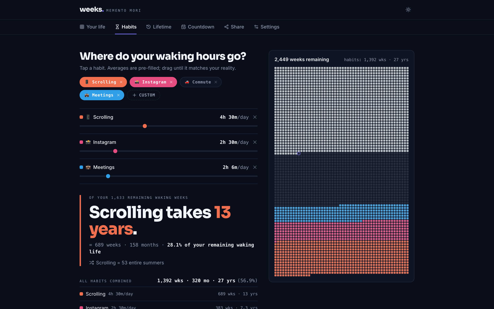
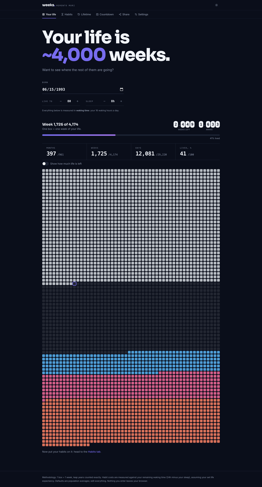
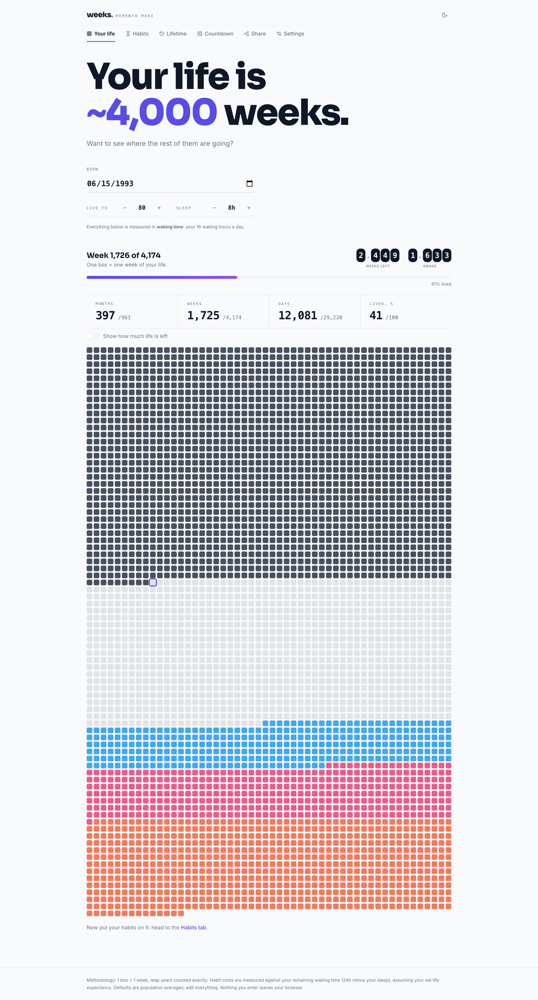
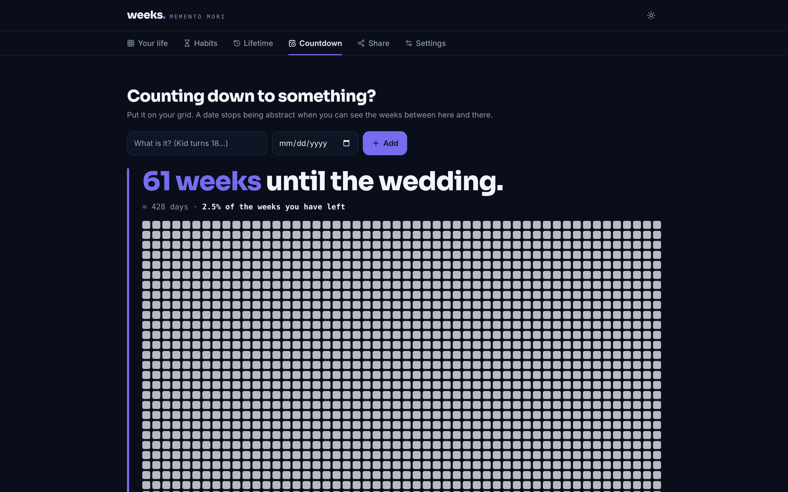

# Weeks

**See what your habits cost in weeks, months, and years of the life you have left.**

**Live demo → [weeks-mu.vercel.app](https://weeks-mu.vercel.app/)**

Your life is ~4,000 weeks. Weeks draws them as a grid, one box per week, then
converts your daily habits into the boxes they consume. 2.5 hours of Instagram
a day is not a number; it is 4.4 years of your remaining waking life, erased
from the end of the grid.

Sibling app to [bigpicture](https://github.com/avnath13/bigpicture), sharing
its design system (tokens, Sora/Inter, motion, event palette).



## Features

- **Life grid.** Canvas-rendered, 4,000+ cells, animated fill. Lived weeks,
  remaining weeks, and habit costs painted from the end of life backwards.
  Leap years counted exactly.
- **Habits converter.** Tap preset chips (Scrolling, Instagram, Commute,
  Meetings) or add your own; drag sliders and watch the grid react beside the
  controls. Everything is denominated in your waking hours (24h minus your
  sleep).
- **Screen Time import.** Drop an iOS Screen Time or Android Digital
  Wellbeing screenshot; it is OCR'd entirely on-device (Tesseract.js) into
  per-app hours. Nothing is uploaded, ever.
- **Reclaim mode.** Drag a habit down and watch the weeks return as an
  emerald band.
- **Lifetime.** The retrospective view: years already spent sleeping,
  working, and scrolling, next to what is still to come.
- **Countdown.** Name a date and see the weeks between here and there
  highlighted on your grid, with "time left today" rings.
- **Share cards.** Deterministic canvas renders, 1080×1920 story and
  1200×630 OG, in the app's editorial style.
- Light/dark themes, mobile-first, localStorage only, no accounts, no
  backend. A Settings tab resets everything.

<table>
  <tr>
    <td></td>
    <td></td>
  </tr>
</table>



## Develop

```bash
npm install
npm run dev      # http://localhost:5173
npm test         # vitest: time math + Screen Time parser (50 tests)
npm run build    # typecheck + production bundle
```

Screenshots regenerate with `node scripts/screenshots.mjs` while the dev
server is running.

## Privacy

Birth date, habits, and screenshots never leave the browser. There is no
server, no analytics, and no account. The Settings tab wipes all local data.
